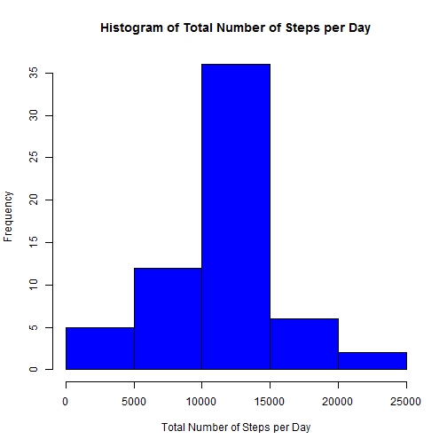

## Title:     "Reproducible Research: Peer Assessment 1"
##            "A Coursera Course"
## Lecturer:  Roger D. Peng, PhD
## Author:    Yosep Thie
<br>
## Loading and preprocessing the data
#### "act" = Activity Data Frame

```r
setwd("C:/Users/Ythie/Documents/Github/RepData_PeerAssessment1")
act <- read.csv('activity.csv', header = T)
```
<br>
## What is mean total number of steps taken per day?
#### "acttot" = total number of steps taken per day
#### "actavg" = mean of total number of steps taken per day
#### "actmed" = median of total number steps taken per day

```r
acttot <- aggregate(act$steps ~ act$date, act, sum, na.action = na.pass)
hist(acttot$`act$steps`, xlab = 'Total Number of Steps per Day', main = 
    'Histogram of Total Number of Steps per Day', col = 'Red')
```

 

```r
actavg <- aggregate(acttot$`act$steps` ~ acttot$`act$date`, acttot, mean,
                    na.action = na.pass)
head(actavg)
```

```
##   acttot$`act$date` acttot$`act$steps`
## 1        2012-10-01                 NA
## 2        2012-10-02                126
## 3        2012-10-03              11352
## 4        2012-10-04              12116
## 5        2012-10-05              13294
## 6        2012-10-06              15420
```

```r
actmed <- aggregate(acttot$`act$steps` ~ acttot$`act$date`, acttot, median,
                    na.action = na.pass)
head(actmed)
```

```
##   acttot$`act$date` acttot$`act$steps`
## 1        2012-10-01                 NA
## 2        2012-10-02                126
## 3        2012-10-03              11352
## 4        2012-10-04              12116
## 5        2012-10-05              13294
## 6        2012-10-06              15420
```
<br>
## What is the average daily activity pattern?
#### "actint"  = average number of steps taken across all days
#### "maxstep" = interval with maximum number of steps

```r
actint <- aggregate(act$steps ~ act$interval, act, mean, na.action = na.omit)
plot(actint$`act$interval`, actint$`act$steps`, type = 'l', 
     xlab = '5 Minute Interval', ylab = 'Average Number of Steps',
     main = 'Average Daily Activity Pattern')
```

 

```r
maxstep <- subset(actint, actint$'act$steps' == max(actint$'act$steps'))
print('Interval with Maximum Number of Steps = ')
```

```
## [1] "Interval with Maximum Number of Steps = "
```

```r
print(maxstep$`act$interval`)
```

```
## [1] 835
```
<br>
## Imputing missing values
#### "actna"   = activity with missing value(s)
#### "actmean" = average of steps taken per day
#### Imputing Strategy:
####  Missing values of "actmean" are imputed with mean of average steps per day
#### "actmer"  = new data frame by filling out missing values with mean average
#### "acttot2" = new total number of steps taken per day
#### New Histogram displayed from data frame with no missing values
#### "actavg2" = new mean of total number of steps taken per day
#### "actmed2" = new median of total number of steps taken per day
#### Result: HIstogram looks similar but with higher frequency

```r
actna <- act[!complete.cases(act),]
print('Total Number of Missing Value = ')
```

```
## [1] "Total Number of Missing Value = "
```

```r
dim(actna)
```

```
## [1] 2304    3
```

```r
print('Imputing Strategy: Replace each missing value with mean of total average steps taken per day')
```

```
## [1] "Imputing Strategy: Replace each missing value with mean of total average steps taken per day"
```

```r
actmean <- aggregate(act$steps ~ act$date, act, mean, na.action = na.pass)
actmean$`act$steps`[is.na(actmean$`act$steps`)] <- mean(actmean$`act$steps`,na.rm = T)
names(actmean) <- c('date', 'steps')
actmer <- merge(act, actmean, by = 'date')
actmer$steps.x[is.na(actmer$steps.x)] <- actmer$steps.y[is.na(actmer$steps.x)]
names(actmer) <- c('date', 'steps', 'interval')
actmer <- actmer[,c('date', 'steps', 'interval')]
acttot2 <- aggregate(actmer$steps ~ actmer$date, actmer, sum)
hist(acttot2$`actmer$steps`, xlab = 'Total Number of Steps per Day',
     main = 'Histogram of Total Number of Steps per Day', col = 'Blue')
```

 

```r
actavg2 <- aggregate(acttot2$`actmer$steps` ~ acttot2$`actmer$date`, acttot2, mean)
head(actavg2)
```

```
##   acttot2$`actmer$date` acttot2$`actmer$steps`
## 1            2012-10-01               10766.19
## 2            2012-10-02                 126.00
## 3            2012-10-03               11352.00
## 4            2012-10-04               12116.00
## 5            2012-10-05               13294.00
## 6            2012-10-06               15420.00
```

```r
actmed2 <- aggregate(acttot2$`actmer$steps` ~ acttot2$`actmer$date`, acttot2, median)
head(actmed2)
```

```
##   acttot2$`actmer$date` acttot2$`actmer$steps`
## 1            2012-10-01               10766.19
## 2            2012-10-02                 126.00
## 3            2012-10-03               11352.00
## 4            2012-10-04               12116.00
## 5            2012-10-05               13294.00
## 6            2012-10-06               15420.00
```
<br>
## Are there differences in activity patterns between weekdays and weekends?
#### "day"   = factor variable with "Weekday" and "Weekend" values
#### "actwd" = weekday activity subset
#### "actwe" = weekend activity subset
#### "actintwd" = average steps taken across all weekdays
#### "actintwe" = average steps taken across all weekend
#### Plot using base plot

```r
day <- weekdays(as.Date(act$date))
day[!grepl('^S', day)] <- 'Weekday'
day[grepl('^S', day)] <- 'Weekend'
day <- factor(day)
actmer$day <- day
actwd <- subset(actmer, day == 'Weekday')
actwe <- subset(actmer, day == 'Weekend')
actintwd <- aggregate(actwd$steps ~ actwd$interval, actwd, mean)
actintwe <- aggregate(actwe$steps ~ actwe$interval, actwe, mean)
par(mfrow = c(1,2))
plot(actintwd$`actwd$interval`, actintwd$`actwd$steps`, type = 'l',
     xlab = '5 Minute Interval', ylab = 'Average Number of Steps',
     main = 'Average Weekday Activity Pattern')
plot(actintwe$`actwe$interval`, actintwe$`actwe$steps`, type = 'l',
     xlab = '5 Minute Interval', ylab = 'Average Number of Steps',
     main = 'Average Weekend Activity Pattern')
```

 
